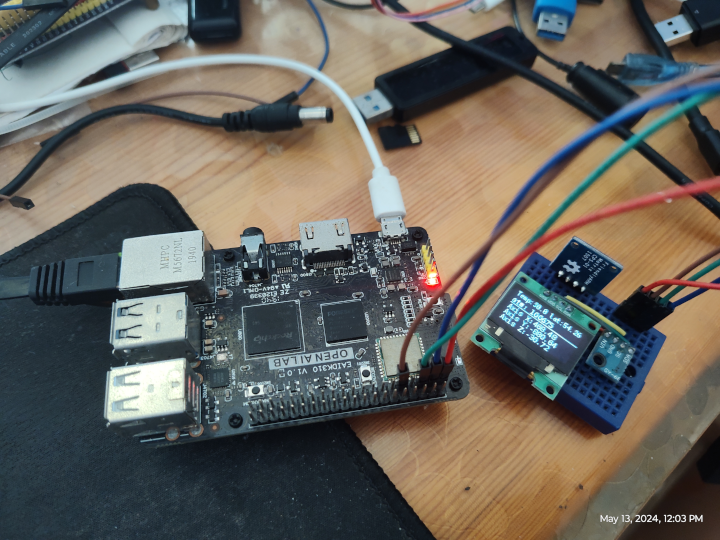

A Python module for accessing multiple i2c devices through only one i2c adapter under Linux.
=======================================
Driver multiple i2c devices on [EAIDK-310](https://github.com/yjdwbj/rockchip-eaidk-310) through one i2c adapter under Linux.

* Links:
  * [smbus2](https://pypi.org/project/smbus2/)
  * [driver-api/i2c.html](https://www.kernel.org/doc/html/v4.12/driver-api/i2c.html)
  * [Luma.OLED: Display drivers ](https://luma-oled.readthedocs.io/en/latest/index.html)
  * [rm-hull/luma.oled](https://github.com/rm-hull/luma.oled)

# Linux System

* Allows users to access i2c devices without root privileges.

```sh
~$ sudo usermod -a -G i2c <login user>
```

* i2cdetect

```sh
~$ i2cdetect -yes 0
     0  1  2  3  4  5  6  7  8  9  a  b  c  d  e  f
00:                         -- -- -- -- -- -- -- --
10: -- -- -- -- -- -- -- -- -- -- -- -- -- -- 1e --
20: -- -- -- -- -- -- -- -- -- -- -- -- -- -- -- --
30: -- -- -- -- -- -- -- -- -- -- -- -- 3c -- -- --
40: -- -- -- -- -- -- -- -- -- -- -- -- -- -- -- --
50: -- -- -- -- -- -- -- -- -- -- -- -- -- -- -- --
60: -- -- -- -- -- -- -- -- -- -- -- -- -- -- -- --
70: -- -- -- -- -- -- -- 77

```

# Introduction: Hardware Devices

## BMP180

* BMP180 is a nice tiny sensor which can give the values of
 * Atmospheric Pressure
 * Temperature
 * Altitude

## HMC5883L

* The Honeywell HMC5883L is a surface-mount, multi-chip module designed for low-field magnetic sensing with a digital interface for applications such as low-cost compassing and magnetometry.The HMC5883L includes our state-of-the-art, high-resolution HMC118X series magneto-resistive sensors plus an ASIC containing amplification, automatic degaussing strap drivers, offset cancellation, and a 12-bit ADC that enables 1° to 2° compass heading accuracy.

## SH1106(or SSD1306)

* The SH1106 display is 128x64 pixels, and the board is tiny. The vendor told me it would be compatible with SSD1306, but the one I tested mine didn't. The driver in Python using I2C on the EDIDK-310.


# Python Runtime

* install pipenv environment

```sh
~$ pipenv install # or pipenv install --three
```

* enter pipenv environment

```sh
~$ pipenv shell
```
* run

```sh
~$ python main.py
```


